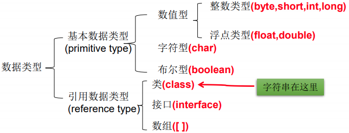

# ⭐基本数据类型 Data Type



# 数据类型默认值：

|  |  | 默认值 |
| --- | --- | --- |
| 整数 | byte; short; int; long | 0 |
| 浮点 | float; double  | 0.0 |
| 字符 | char | ' '  \ u0000 |
| 布尔 | boolean | false |
| 字符串 | String | null |


# 整类型 Integer

- 整型常量(具体值)默认为`int`值。

| 类型 | 中文 | 占用存储空间 | 范围 |
| --- | --- | --- | --- |
| byte | 字节 | 1字节 | -128 ~ 127 |
| short | 短整型 | 2字节 | -2^15 ~ 2^15-1
-32768 ~ 32767 |
| int | 整型 | 4字节 | -2^31 ~ 2^31-1
-2,147,483,648 ~ 2,147,483,647 |
| long | 长整型 | 8字节 | -2^63 ~ 2^63-1 |

**定义方式**

```java
byte   n1 = 1000;
short  n2 = 2000;
int    n3 = 4000;
long   n4 = 8000L;
long   n5 = 8000l;

int    n6 = 4000L;    // Error
```


# 浮点类型 Decimal

- 浮点在计算机中的存放形式。`浮点数=符号位+指数位+尾数位`
- 浮点数有精度问题，尾数部分会丢失，造成精度丢失。推荐使用`double`。
- 浮点型常量(具体值)默认为`double`值。

| 类型 | 中文 | 占用存储空间 | 范围 |
| --- | --- | --- | --- |
| float  | 单精度 | 4字节 | -3.403E38 ~ 3.403E38 |
| double  | 双精度 | 8字节 | -1.798E308 ~ 1.798E308 |

**定义方式**

```java
float  f1 = 3.14f;    // float
double f2 = 3.14f;    // float
double f3 = 3.14F;    // float

double d4 = 3.14;     // double
double d5 = 3.14d;    // double
double d6 = 3.14D;    // double

float  n7 = 3.14;     // Error
```

**数学表达方式**

```java
double n1 = 0.14;
double n2 = .14;
double n3 = 123.0;
double n4 = 5.12e2;  
       // 5.12x10^2 = 512.0
double n4 = 5.12E-2;  
       // 5.12/10^2 = 0.0512
```

## **浮点的精度丢失**

- 对小数进行运算会导致精度丢失

```java
double n1 = 8.1 / 3;  
Sysout.out.println("result " + n1);
// 数学: 2.7
// 计算机: 2.69999999999997
```

```java
double n1 = 3.3 / 3;  
Sysout.out.println("result " + n1);
// 数学: 1.1
// 计算机: 1.09999999999
```

- 不能直接对运算结果是小数的变量进行相等判断。

```java
// Error
double n1 = 8.1 / 3;
if(n1 == 2.7){ 
	System.out.println("Wrong");
}
```

- 由于精度的问题，应该以两个数的差值的绝对值为相等的判断。差值非常小了，就可认为是相等。

```java
// Correct
double n1 = 8.1 / 3;
double absolute = Math.abs(n1 - 2.7); // 4.4408920E-16

if(absolute < 0.00000001){ 
	System.out.println("Correct");
}
```


# 字符类型 Character

- 字符常量用单引号`’ ’`括起来。
- `char`的本质是一个整数，输出的`Unicode`对应的字符。
- `char`可以参与数字运算，输出的整数数字。
- 两个`char`运算时，char作为整数进行运算，输出一个整数。

| 类型 | 中文 | 占用存储空间 | 范围 |
| --- | --- | --- | --- |
| char | 字符 | 2字节 | 1个字母，数字，转义符，ASK II 码，汉字 |

```java
char c1 = 'a';    // English characters
char c2 = '音';   // Chinese character，只适用于包含中文的编码
char c3 = '\t';   // escape character 
char c4 = '1';    // degit
char c5 = 97;     // code，Unicode的97代表a，编码没有单引号''
```

**字符类型细节**

- `char`的本质是一个整数。计算机储存的是2字节的整数编码。

```java
char c1 = 'a';
System.out.println((int)c1);  // 输出a的unicode，97

char c2 = 'b' + 1;
System.out.println((int)c2);   // 输出 99   输出的是 b(98)+1 的数字
System.out.println(c2);        // 输出 c    输出的是 b(98)+1 的ASCII字符
```

# 布尔类型 Boolean

- 一字节，只能存储`true`或`false`。
- Java 不能用`0`或`非0`代表`true`或`false`。如：`C`可以，但`Java`不可以

| 类型 | 中文 | 占用存储空间 | 范围 |
| --- | --- | --- | --- |
| boolean | 布尔 | 1字节 | ‘true’ or ‘false’ |

```java
boolean b1 = true;
```