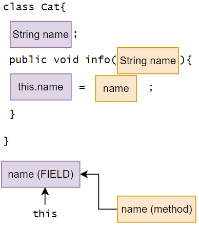
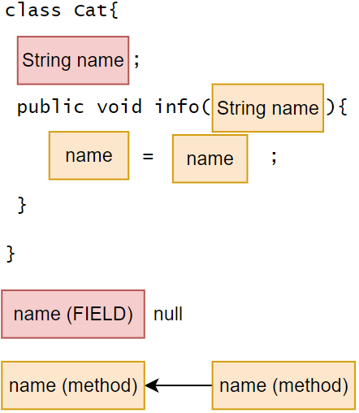

# 关键字 — this，this()


📌 `this`代表 ”当前对象“ 的 xxx 部件（如：属性，方法）。而不是局部变量的方法。

> `this.name` 等同于 `cat1.name`
            this 等同于 cat1。
            this 等同于 当前对象。
> 
- `this`关键字可以用来访问当前类的属性、方法、构造器。
    - `this`只能在类定义的方法内部使用，不能在类定义的外部使用。
- `this`用于区分当前类的属性和局部变量（允许方法形参和属性同名，代码更整洁，见名知意。）

## `this`

**访问属性/方法：**`this.方法名（参数列表）`。

- 访问时要匹配形参列表。

```java
class Cat{
	String name;
	public void getInfo(){
		// ...
	}
	public void run(){
		this.getInfo();		// 相当于 Cat.getInfo()
	}
}
```

### `this.name` vs `name`

✅ **有this**

- **指定属性。**

```java
...
cat1.info("Nick");
cat1.name;  // "Nick"  <---
...
class Cat{
	String name;
	public void info(String name){
		this.name = name;
	}
}
```



❌ **无this**

- **就近原则。**最近的同名局部变量，可以是方法局部变量，形参列表等。

```java
...
cat1.info("Nick");
cat1.name;  // null  <---
...
class Cat{
	String name;
	public void info(String name){
		name = name;
	}
}
```




💡 方法形参和属性同名，由于作用域的关系，`name`代指的是最近的 ”name”，也就是方法的`name`。


## 🔥`this()`

**访问构造器：**`this(参数列表)`。


💡 在构造器里访问构造器。

- 只能在构造器中使用，一个构造器只能用thie访问另一个构造器。（不可以同时访问两个构造器）
- 访问时也要匹配形参列表。
- 如果使用了`this`访问另一个构造器，**`this`语句必须放置在第一条语句**。

```java
class Cat{
	String name;

	public Cat(){
		this("Nick");  // 访问了Cat(String name)构造器
	}
	public Cat(String name){
		// ...
	}
}
```