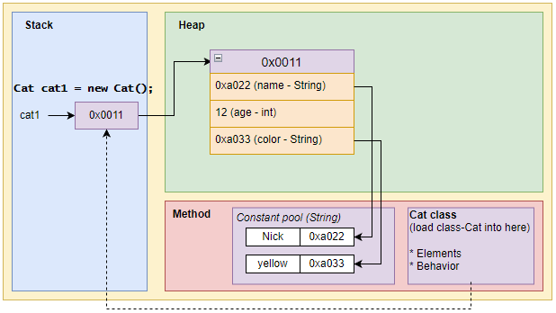
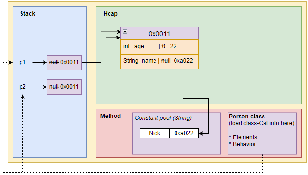
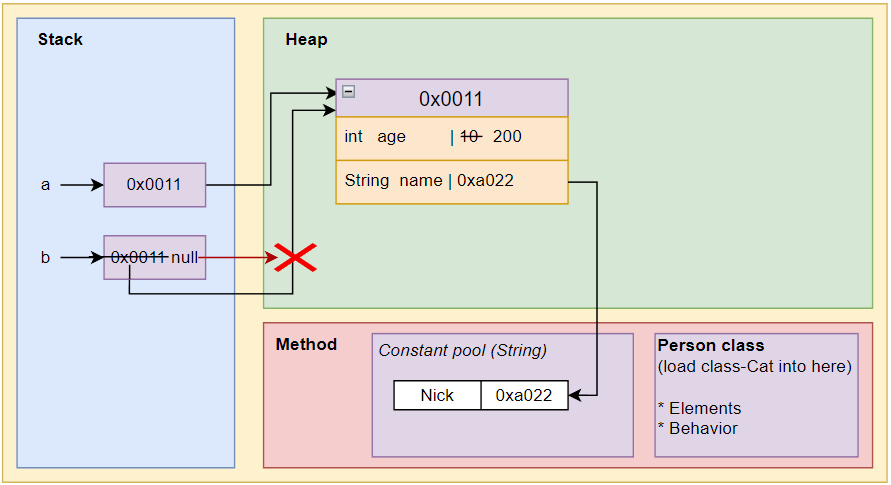
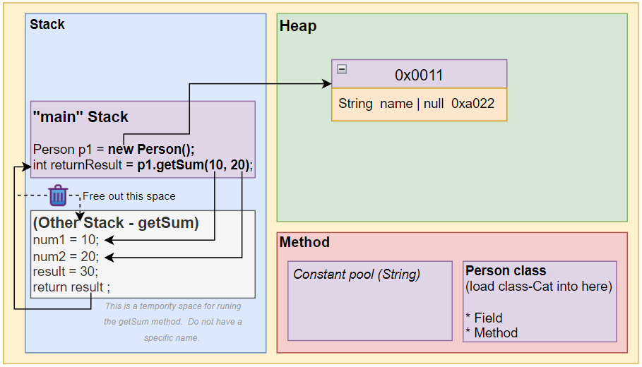

# ⭐基本使用 & 内存分配机制

## 实例化对象时的内存原理

例子：

```java
Cat cat1 = new Cat();
cat1.name = "Nick"; 
cat1.age = 3;
cat1.color = "yellow"
```

🔥 堆空间（实际空间）里的才是真正的对象`new Cat();`，其他的都只是引用`cat1`（对象引用）。



堆里面的才是对象实际的空间（类似于数组），可以被多个对象名引用。
cat1是对象名，只是对象引用，储存的是对象的地址值。

## 对象分配机制

```java
class Parson {				// 加载Person类信息到方法区
    private int age;
    private String name;
}
Person p1 = new Person();	/* 在栈中创建p1对象名，此时的值为null。
								在堆中分配p1(对象实例化)内存空间，并包含对应的Person属性。此时属性值是默认值。
								把内存地址值赋给对象p1。p1指向对象。
							*/
p1.age = 22;				// 把p1.age属性改成22
p1.name = "Nick";			// 把p1.name属性改成"Nick"
Person p2 = p1;				// 在栈中创建p2对象，并把p1的地址值赋给p2。（p2没有创建新的内存空间，它的地址值是p1)

System.put.prontln("p2 age is " + p2.age);
// p2 age is 22

p1.age = 30;  // or p2.age = 30;  都是对同一个数值进行操作
System.put.prontln("p2 age is " + p2.age);
// p2 age is 30
```



## 空指针异常时的内存原理

```java
Person a = new PersonO;
a.age = 10;
a.name = "Nick";
Person b;
b = a;
System.out.println("b name is " + b.name);	// b name is Nick

b.age = 495;
b = null;	
System.out.println("a age is " + a.age);	// a age is 495
System.out.println("b age is " + b.age);	// Error!!! Null_Pointer_Exception, 编译通过，但会出现异常。
```




## 方法执行和垃圾回收的内存原理

📌 每当程序执行到方法时（包括main方法），就会**开辟**一个临时的独立的栈空间，用于执行这个方法。
这个独立的栈空间会在方法结束时**删除/释放**掉。

```java
Public class Method01{
	public static void main(String[] a){
		Person p1 = new Person();
		int returnResult = p1.getSum(10, 20);  
	}
}

class Person{
	// field
	String name;

	// method
	public int getSum(int num1, int num2){
		int result = n1 + n2;
		return result;
	}
}
```


1. 每当程序执行到方法时，就会**开辟**一个临时的独立的栈空间，用于执行方法。

2. 顺序执行完方法 或 执行到return后，**释放/删除**这个临时的栈空间。然后继续执行后面的代码。


🔥 main方法也是个方法。当执行完main方法后，也会删除当前方法的栈空间（也就是main），代表退出整个程序。