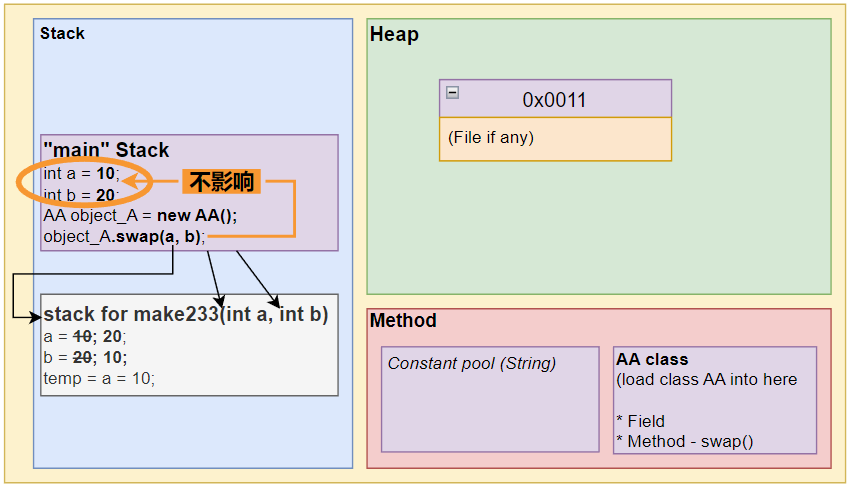
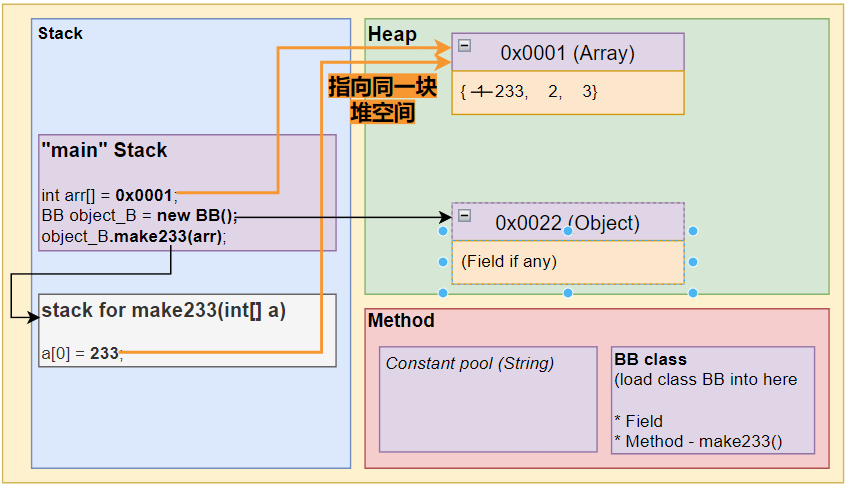
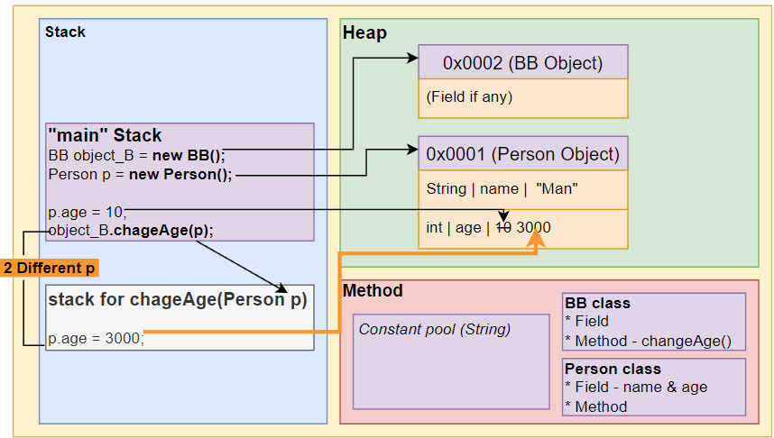
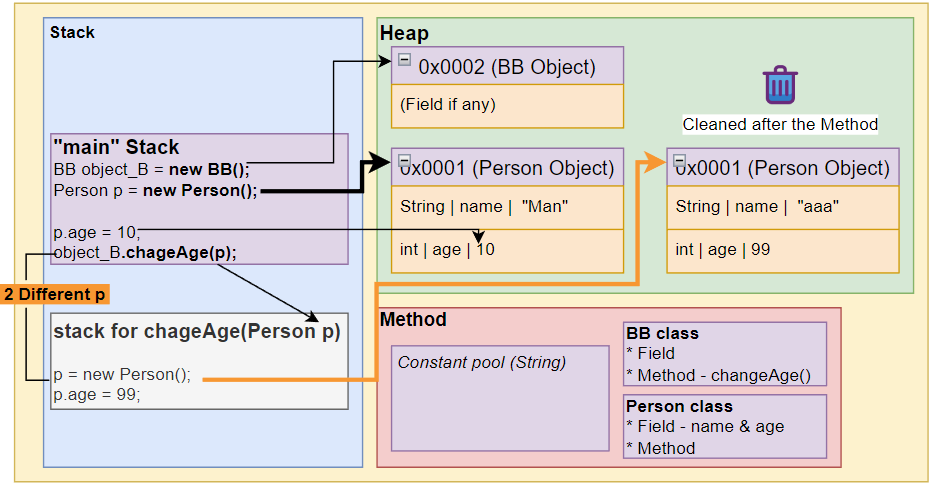

# ⭐方法参数传递机制 Method Parameter

## 基本数据类型

💡 **每个方法有自己独立的栈空间。**
基本数据类型下：一个方法里对变量的变动不会影响其他方法里的变量。（如：`main`方法）


📌 **基本数据类型，传递的是值（值拷贝），形参的任何改变不影响实参！**


```java
public class MethodParameter {
	public static void main(String[] args){
		int a = 10;
		int b = 20;
		AA object_A = new AA();
		object_A.swap(a,b);   // <--- 复制传入数值到别的**独立的栈**（不是地址值）。
		System.out.println("a = " + a + ", b = " + b); 
		// !!! After Method: swap: a = 10, b = 20
	}
}

class AA {
	public void swap(int a, int b){
		System.out.println("a = " + a + ", b = " + b); // Before swap: a = 10, b = 20
		int temp = a;
		a = b;
		b = temp;
		System.out.println("a = " + a + ", b = " + b); // Before swap: a = 20, b = 10
	}
}
```



make233(int a, int b); 写错了，应该是swap(int a, int b)。

## 引用数据类型 — 传递数组


📌 **引用数据类型，传递的是地址值，可以通过形参影响实参！**


```java
public class MethodParameter {
	public static void main(String[] args){
		BB object_B = new BB();
		int[] arr = {1,2,3};
		object_B.make233(arr);  // <--- 传递的时地址值，指向同一个空间。

		for(int i = 0; i < arr.length; i++){
			System.out.print(arr[i] + " ");
		} // 233, 2, 3
	}
}
class BB {
	public void make233(int[] a) {
		a[0] = 233;
		for(int i = 0; i < a.length; i++){
			System.out.print(a[i] + " ");
		} // 233, 2, 3
		System.out.println();
	}
}
```



## 引用数据类型 — 传递类


📌 **引用数据类型，传递的是地址值，可以通过形参影响实参！**


### Case 1 - `p.age = 3000;`


✂️ **在方法里**改变形参对象的值。会影响到`main`，因为都指向同一个空间。


```java
public class MethodParameter {
	public static void main(String[] args){
		BB object_B = new BB();
		Person p = new Person();

		p.age = 10;
		System.out.print(p.age);  // <--- age is 10

		object_B.chageAge(p);
		System.out.print(p.age);  // <--- age is 3000
	}
}

class Person{
	String name;
	int age;
}
```

```java
class BB {
	public void chageAge(Person p){
		p.age = 3000;
	}
}
```



### Case 2 - `p = null;`


✂️ **在方法里**把形参对象的地址`null`掉。不会改变`main`指向的空间，因为只是`null`掉方法自己的指向。

```java
class BB {
	public void chageAge(Person p){
		p = null;
	}
}
```


null的是方法里面的p，mian方法的p没有变动。
`System.out.println(p.age);` 输出是10;


### Case 3 - `p = new Paerson();`


✂️ **在方法里**用形参对象新建一个对象，指向一个新的空间。不会改变`main`指向的空间。


```java
class BB {
	public void chageAge(Person p){
		p = new Person();
		p.age = 99;
	}
}
```

