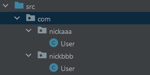
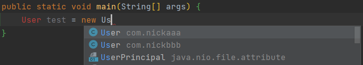
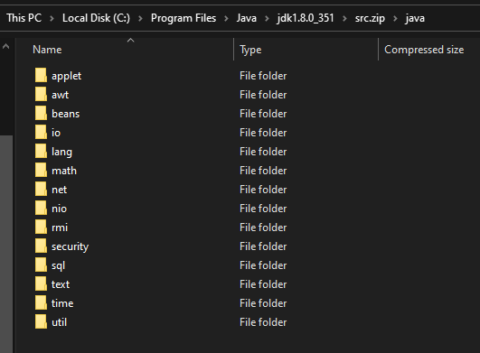
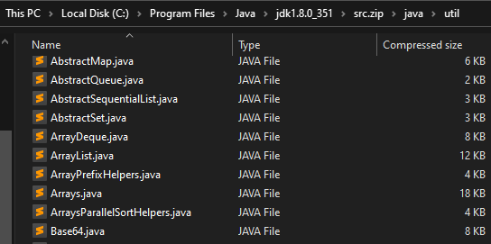

# 包 Package


💡 包的作用：
1. 区分相同名字的类（不同包之间相互独立，不会出现重名）
2. 当类很多时，很好的管理类
3. 控制访问范围


🎯 包的本质就是用来保存 类文件 的**文件夹**。

```java
package com.packagename; 
import com.packagename.Mocdel;

public static void main(String[] args){...}
```

- `package`的作用是声明当前类所在的包，只能放在类的最上面，一个类中最多只有一句`package`
- `import`指令位置放在`package`的下面，在类定义前面，可以有多句且没有顺序要求


## 包的命名规则

* 只能包含数字、字母、下划线、小圆点。但不能用数字开头，不能是 关键字 或 保留字。

* 小写字母 +`.`。一般是：`com.公司名.项目名.业务模块名`

```java
package com.nickaaa.user        // 用户模块
import com.nickaaa.exception    // 报错处理模块
import com.nickaaa.utils        // 工具类
```


## 包的使用

### 创建包

创建新的包：进入IDEA → 右键 “src” → “New” → “Package” → 命名 `com.xxx`

> xxx.yyy ：代表创建 xxx 目录和，创建在 xxx 目录下 yyy
> 

此时在不同包可以创建 ”同名” 类。



### 导入包

- 导入包的**一个**类。`import java.util.Scanner;` **建议**导入需要单个/数个类。
- 导入包的**所有**类。`import java.util.*;` **不建议**一次性导入所有类

```java import com.usercenter.exception;    // Error handling module
import com.nickaaa.exception;
import com.nickaaa.utils;
```


### 使用包

在其他方法（如：main 方法）可以引入 `import com.nickaaa.User` 和使用对应包的类。



当使用两个不同包的`同名类` 如：我需要使用`nickaaa.User` 和 `nickbbb.User`。

- 不能同时引入**不同包**的**同名类**。
- 只能导入其中一个，另一个只能直接引用

```java
import com.nickaaa.User;

public static void main(String[] args){
	User test1 = new User();   						// 导入的是com.nickaaa.User，所以这里用的是nickaaa的User

	com.nickbbb.User test2 = new com.nickbbb.User(); // 由于不能导入同名类，所以这里直接引用nickbbb的User
}
```

## Java 常用包

- **java.lang**：lang包是基本包，默认引入，不需要再引入
  
    ```java
    // import java.lang.Math;  不需要引入java的lang包
    
    public static void main(String[] args){
    	int num1 = Math.abs(-1); // 求绝对值的java.lang方法
    }
    ```
    
- **java.util**：util包，Java 提供的工具包，工具类，Scanner
- **java.net**：网络包，网络开发
- **java.awt**：是做java的界面开发，GUI

## JDK 里的 Java 包

可以在电脑的这里路径下 C:\Program Files\Java\jdk1.8.0_351\src.zip\java 找到更多的 Java 包



Util 包里面的类

