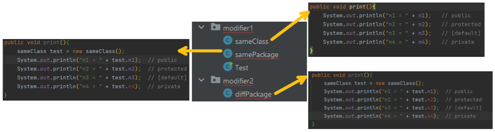

# 访问修饰符
💡 访问修饰符：控制方法和属性的访问权限。


## 修饰符权限范围

| 访问修饰符 | 访问级别 | 同一个类里* | 同一个包里 | 同一个子类里 (继承) | 不同包里 (任意不同包) |
| --- | --- | --- | --- | --- | --- |
| public | 公开 | ✅ | ✅ | ✅ | ✅ |
| protected | 受保护 | ✅ | ✅ | ✅ | ❌ |
| [没有修饰符] | 默认 | ✅ | ✅ | ❌ | ❌ |
| private | 私有 | ✅ | ❌ | ❌ | ❌ |

> “同一个类”也可以被称为：“本类”，或 “当前类”
> 

### **例子：**

1. 在modifier1.sameClass里定义不同访问级别的n1, n2, n3, n4（下面的代码）。

```java
package com.modifier1.sameClass
class Main {
	public void static main(String[] args){
		public int n1;
		protected int n2; 
		int n3; 
		private n4;
	}
}
```

1. 并尝试在`sameClass`, `samePackage`, `diffPackage`类里调用它们。

​	

## 运用

### 修饰属性

```java
public int n1 = 100;
protected int n2 = 200;
int n3 = 300;
private int n4 = 400;
```

### 修饰方法

```java
public void m1(){ ... }

protected void m2(){ ... }

void m3(){ ... }

private void m4(){ ... }
```

### 修饰类

只有 `[默认]` 和 `public` 可以修饰类。

```java
package com.package;

public class c1{
}

class c2{
}
```

```java
package com.main;

public static void main(String args[]){
	c1 test1 = new c1(); // OK, c1的访问范围是public 

	c2 test2 = new c2(); // 错误！c2的访问范围是[default]，不能访问
}
```