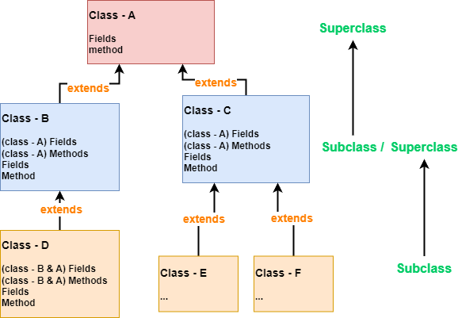

# 📌 继承 Extends (1. 基本)


💡 继承：可以提高代码复用性，扩展性 和 维护性。

```java
public class Subclass extends Superclass{ ... }
```


# 概念


💡 子类(subclass)继承**所有**父类(superclass)属性和方法。继承后的属性和方法，**等同于自己拥有**。

<aside>
🧩 扩展性 和 维护性：修改父类时，所有子类自动自动继承了新的改动。




# 不使用继承 vs 使用继承🔧


✅ 从类中抽象出父类，在父类中定义这些相同的属性和方法，所有的子类不需要重新定义这些属性和方法，只需要通过extends来声明继承父类即可。

1. 抽象出一个新的父类。
2. 父类中定义共有的属性和方法。
3. 子类通过`extends`来继承父类所有的属性和方法。

## 不使用继承 - 低代码复用性，扩展性 和 维护性

📌 多个类之间存在大量完全相同的属性和方法。
如：只有`printInfo()`的输出语句不一样，其他完全一样。**这时就可以用到继承。**

```java
public class Pupil {
  public String name;
  public int age;
  private double score;

  public void setScore(double score) {
      this.score = score;
  }

  public void printInfo(){
      System.out.println(name +
			"is Pupile")
  }
}

// Graduate 存在很多于 Pupil 一样的属性和方法，
// 学术信息都有name, age, score 等属性和方法。
public class Graduate {
  public String name;
  public int age;
  private double score;

  public void setScore(double score) {
      this.score = score;
  }

  public void printInfo(){
      System.out.println(name +
			"is Graduate");
  }
}
```


## 使用继承 - 高代码复用性，扩展性 和 维护性

`Student.java` **— NEW!!!** 

```java
public class Student {
  public String name;
  public int age;
  private double score;

  public void setScore(double score) {
      this.score = score;
  }
}

// 由于(extend)继承了Student类，
// 等同于自己也拥有name, age, score 等属性和方法
public class Pupil extends Student {
	// 也可以拥有Pupil自己特有的方法 
	public void printInfo(){ System.out.println(name + "is Pupile");}
}


public class Graduate extends Student{
	// 也可以拥有Graduate自己特有的方法 
	public void printInfo(){ System.out.println(name + "is Graduate");}
}
```

