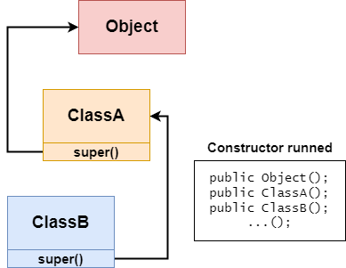

# 📌 继承 Extends (2. 细节)

## 1. 间接访问私有属性和方法

💡 子类继承了所有的属性和方法。
**非私有的属性/方法**可以在子类直接访问。但是
**私有属性/方法**不能在子类**直接访问**，要父类提供**通过公共**的方法去访问。


### 不能直接访问非私有方法

`Super.java`

```java
public class Super{

  public int n1 = 100;
  protected int n2 = 200;
  int n3 = 30;
  private int n4 = 400;

  public void test1(){ ... }
  protected void test2(){ ... }
  void test3(){ ... }
  private void test4(){ ... }
}
```

`Sub.java`

```java
public class Sub extends Super{
  public void test(){
    int a = n1; // public
    int b = n2; // protected
    int c = n3; // default
    int d = n4; // private - Error

    test1(); // public
    test2(); // protected
    test3(); // default
    test4(); // private - Error
  }
}
```

### 提供**通过公共方法**访问私有方法

`Super.java`

```java
public class Super{

    public int n1 = 100;
    protected int n2 = 200;
    int n3 = 30;
    private int n4 = 400;

    public void test1(){ ... }
    protected void test2(){ ... }
    void test3(){ ... }
    private void test4(){ ... }

    public int getN4(){
        return n4;
    }
    public void callTest4(){
        test4();
    }
}
```

`Sub.java`

```java
public class Sub extends Super{
  public void test(){
    int a = n1; // public
    int b = n2; // protected
    int c = n3; // default
    int d = getN4(); // OK, using public method to get private n4

    test1(); // public
    test2(); // protected
    test3(); // default
    callTest4(); // Ok, using public method to get private test4
  }
}
```

## 2. Java所有类都是Object类的子类，Object是所有类的父类。

- ctrl + H 可以查看类的继承关系
- 所有没有写`extends()`继承的类，默认继承了Object类`public class AAA extends Object{}`

## 3**.** 父类构造器的调用不限于直接父类。将一直往上追潮直到Object类（顶级父类）



```java
public class AAA {
	public AAA(){
		super(); // 在没有extends时可以使用super()，代表隐藏了一个extends Object的继承。
	}
}
```

## 4. Java单继承机制：子类最多只能继承一个父类（指直接继承）

如何让A类同时继承B类和C类的方法？

解：A类 —继承→ B类 —继承→ C类。A类就可以同时使用B和C类的方法。

## 5. 不能滥用继承，子类和父类之间必须满足is-a的逻辑关系

✅ Cat **is a** Animal `public class Cat extend Animal{ }` 

✅ Bachelor Student **is a** Student `public class BachelorStudent extend Student{ }`

❌ Student **is a** University