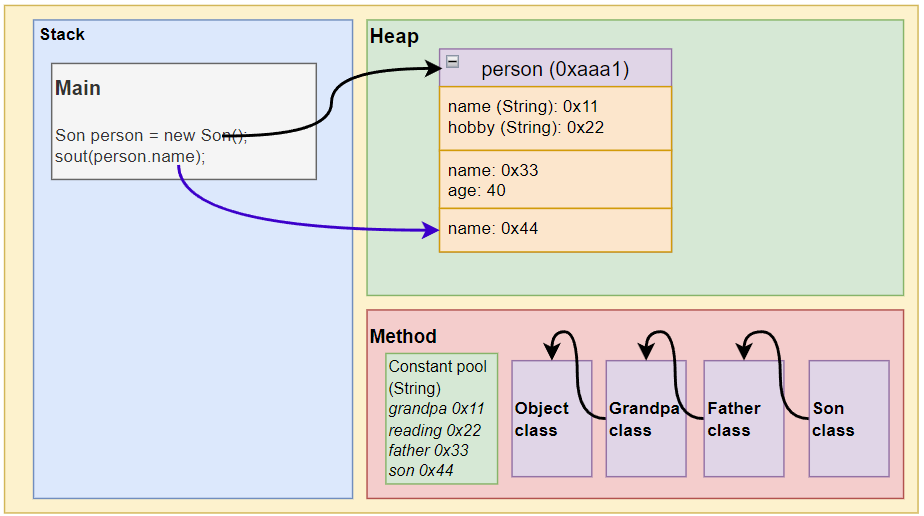

# 📌 继承 Extends (3. 调用成员时的顺序)

## 有继承关系的类之间可以有同名属性/方法


💡 `new`一个有继承关系的子类时，他自己的类和所有的父类都有独立的内存空间。**代表类之间可以有同名属性/方法。**


## 两种调用成员的顺序

### `method()`和`this.method()`正常情况


💡 **查找有继承关系的子类的属性/方法：**


1. 首先看本类是否有该属性，如果有这个属性，**并且可以访问***，则返回信息；**否则直接报错***。

2. 如果本类没有这个属性，就向上查找父类有没有这个属性，如果父类有该属性，**并且可以访问**，就返回信息；**否则直接报错**。

3. 如果父类没有就按照(3)的规则，继续找上级父类，直到Object。

  

### `super.method()`跳过本类（其他规则一样）


💡 **查找有继承关系的子类的属性/方法：**


1. **跳过本类**。
2. **直接查找父类**有没有这个属性，如果父类有该属性，**并且可以访问**，就返回信息；**否则直接报错**。
3. 如果父类没有就按照(3)的规则，继续找上级父类，直到Object。

**可以访问**代表：属性/方法不是private。如果是private不可访问，就创建一个返回这个private的公共方法。

```java
main(){
	...
	System.out.println(person.age);  
}

class GrandPa{
	int age = 70;
}
class Father extends GrandPa{
	private int age = 40;  // <--停在这里
} 
class Son extends Father {
	
}
```

**否则直接报错**代表：只要找到指定名字的属性/方法，要么返回 - 可以访问，要么报错 - private；不会跳过报错找下一个。

> 合理创建唯一的**公共方法**：
1. 返回某个private属性/方法。或
2. 直接访问某个属性/方法，避免报错。
## 例子

```java
public class ExtendsTheory {
	public static void main(String[] args){
		Son preson = new Son();  
		System.out.println(person.name);  // return: son  2. 最先在son找到name。并可以访问。
		System.out.println(person.age);   // return: 40   2. 最先在father找到age。并可以访问。
		System.out.println(person.hobby); // return: reading 2. 最先在grandpa找到hobby。
	}
}

class GrandPa{
	String name = "grandpa";  // 1. 类之间可以有同名属性/方法
	String hobby = "reading";
}
class Father extends GrandPa{
	String name = "father"：  // 1. 类之间可以有同名属性/方法
	int age = 40;
} 
class Son extends Father {
	String name="son";       // 1. 类之间可以有同名属性/方法
}
```

