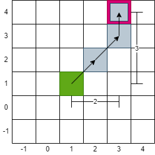
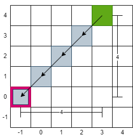

# 1266. 访问所有点的最小时间

# 问题

平面上有 `n` 个点，点的位置用整数坐标表示 `points[i] = [xi, yi]` 。请你计算访问所有这些点需要的 **最小时间**（以秒为单位）。

你需要按照下面的规则在平面上移动：

- 每一秒内，你可以：
  - 沿水平方向移动一个单位长度，或者
  - 沿竖直方向移动一个单位长度，或者
  - 跨过对角线移动 `sqrt(2)` 个单位长度（可以看作在一秒内向水平和竖直方向各移动一个单位长度）。
- 必须按照数组中出现的顺序来访问这些点。
- 在访问某个点时，可以经过该点后面出现的点，但经过的那些点不算作有效访问。

**示例 1：**


```
输入：points = [[1,1],[3,4],[-1,0]]
输出：7
解释：一条最佳的访问路径是： [1,1] -> [2,2] -> [3,3] -> [3,4] -> [2,3] -> [1,2] -> [0,1] -> [-1,0]   
从 [1,1] 到 [3,4] 需要 3 秒 
从 [3,4] 到 [-1,0] 需要 4 秒
一共需要 7 秒
```

**示例 2：**

```
输入：points = [[3,2],[-2,2]]
输出：5
```


> 问题链接: [LeetCode - 1266. 访问所有点的最小时间 (简单)](https://leetcode.cn/problems/minimum-time-visiting-all-points/)
>
> 相关标签：寻路 数学 数组

# 思路

问题只需要返回移动的次数，相当于点与点之间的`距离`，就是经典的寻路和最短路径。

由于问题给的很宽松，可以斜着走，可以穿过点而不访问等，基本没什么没有限制，很自由。所以可以通过计算两点之间（x和x1，y和y1）的不同从而算出最短路径。

# 关键

- 由于可以斜着走的关系“`x到x1`和`y到y1`的距离之间的最大值就是最短距离”
- 距离：通过x1-x的方式算出的”两点之间的不同”可能会有负数。如：([3,4] 到 [-1,0]; `(-1) - 3 = -4`)。所以需要使用`Math.abs(int)`来换算成绝对值，代表距离，可以更方便地计算总距离。
- 最大值：通过使用`Math.max(int, int)`找出并返回最大值，不用自己写if-else。

例子：[1,1] 到 [3,4]。距离 = 3

```java
x = 1, x1 = 3
xDiff = Math.abs(x1 - x) = |3 - 1| = 2

y = 1, y1 = 4
yDiff = Math.abs(x1 - x) = |4 - 1| = 3

distance = Math.max(xDistance, yDistance) = 3 < 2 = 3
```



例子：[3,4] 到 [-1,0]。距离 = 4

```java
xDiff = 4
yDiff = 4
distance = 4
```




# 代码

方法1：直接算距离

```java
public int minTimeToVisitAllPoints(int[][] points) {
    int res = 0; 
    for(int i = 0; i < points.length - 1; i ++){
				// 下一个x点减去当前x点，然后绝对值。算出x的距离
        int xDistance = Math.abs(points[i+1][0] - points[i][0]);
				// 下一个y点减去当前y点，然后绝对值。算出y的距离
        int yDistance = Math.abs(points[i+1][1] - points[i][1]);
				// x和y距离的的最大值就是最短路径。积累到res里
        res += Math.max(xDistance, yDistance);
    }
    return res;
}
```

方法2：一步一步走（慢）

这题可以用数学方式解决直接算出最大值，可以不用一步一步模拟行径。

```java
public int minTimeToVisitAllPoints(int[][] points) {
    int res = 0;
    int x = points[0][0];
    int y = points[0][1];
    for(int i = 1; i < points.length; i++){
        while(x != points[i][0] || y != points[i][1]){
            int xDiff = diff(x, points[i][0]);
            int yDiff = diff(y, points[i][1]);
            /*
				移动当前位置
			*/
            // move diagonally   
            if(yDiff != 0 && yDiff != 0){
                x += xDiff;
                y += yDiff;
                res++;
                continue;
            }
            // move vertically 
            if(yDiff != 0){
                y += yDiff;
                res++;
                continue;
            }
            // move horizontally  
            if(xDiff != 0){
                x += xDiff;
                res++;
                continue;
            }
        }
    }
    return res;
}
// 找出两点x1-x/y1-y的距离，判定该往左右/上下还是不不动
public int diff(int current, int target){
    if(target - current > 0){
        return 1;
    }else if(target - current < 0){
        return -1;
    }else{ 
        return 0;
    }
}
```