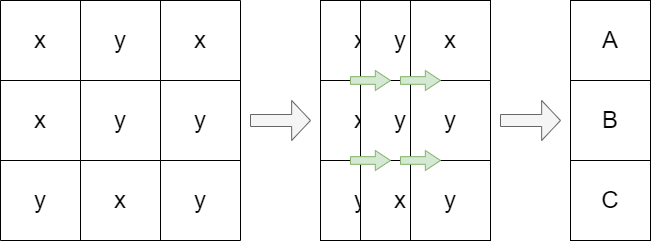
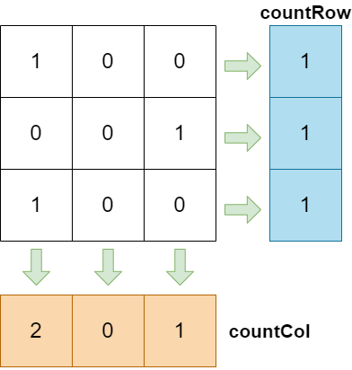
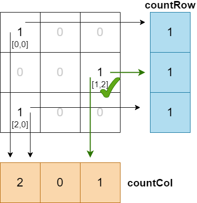
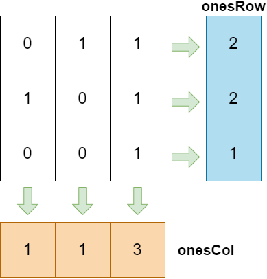

# 1582 + 2482 （二维矩阵的一维抽象化）

💡 二维抽象成一维的作用当然是降低复杂度。



> 问题链接: [LeetCode - 1582. 二进制矩阵中的特殊位置 (简单)](https://leetcode.com/problems/special-positions-in-a-binary-matrix/)
>
> 相关标签：贪心 2维数组

> 问题链接: [LeetCode - 2482. 行和列中一和零的差值 (中等)](https://leetcode.cn/problems/difference-between-ones-and-zeros-in-row-and-column/)
>
> 相关标签：数组 矩阵


# 1582. 二进制矩阵中的特殊位置

## 问题

给你一个大小为 `rows x cols` 的矩阵 `mat`，其中 `mat[i][j]` 是 `0` 或 `1`，请返回 **矩阵 `mat` 中特殊位置的数目** 。

**特殊位置** 定义：如果 `mat[i][j] == 1` 并且第 `i` 行和第 `j` 列中的所有其他元素均为 `0`（行和列的下标均 **从 0 开始** ），则位置 `(i, j)` 被称为特殊位置。

**示例 1：**


```
输入：mat = [[1,0,0],
            [0,0,1],
            [1,0,0]]
输出：1
解释：(1,2) 是一个特殊位置，因为 mat[1][2] == 1 且所处的行和列上所有其他元素都是 0
```

**示例 2：**


```
输入：mat = [[1,0,0],
            [0,1,0],
            [0,0,1]]
输出：3
解释：(0,0), (1,1) 和 (2,2) 都是特殊位置
```

**示例 3：**

```
输入：mat = [[0,0,0,1],
            [1,0,0,0],
            [0,1,1,0],
            [0,0,0,0]]
输出：2
```

**示例 4：**

```
输入：mat = [[0,0,0,0,0],
            [1,0,0,0,0],
            [0,1,0,0,0],
            [0,0,1,0,0],
            [0,0,0,1,1]]
输出：3
```

> 问题链接: [LeetCode - 1582. 二进制矩阵中的特殊位置 (简单)](https://leetcode.com/problems/special-positions-in-a-binary-matrix/)
>
> 相关标签：贪心 2维数组


## 思路

理解题目：`mat[i][j] == 1` 并且第 `i` 行和第 `j` 列中的所有其他元素均为 `0` 可以分解为

* "位置 `(i, j)` 的当前"行"所有其他元素均为 `0` " 可以理解为是整行只有一个1。
* 加上"位置 `(i, j)` 的当前"列"所有其他元素均为 `0` " 

所以题目可以理解为当前格子为1时，同事整行只有一个1，且整列也只有一个1。才能称为特殊位置。

> 有点类似于数独


## 关键

💡 二维矩阵的一维抽象化

关键词 "整行/列只有一个1"。可以通过把整行的数相加，从而知道当前"行"共有多少个1。"列"同理。
* 相加后=0：表示当前"行/列"没有一个1，不符合题目
* 相加后=1：表示当前"行/列"总共只有一个1，符合题目
* 相加后>1：表示当前"行/列"总共有多个1，不符合题目




特殊位置：当"行"等于1的同时"列"也等于1



| `mat[i,j]` | countRow | countCol | is special position |
| ---------- | -------- | -------- | ------------------- |
| [0,0]      | 1        | 2        | No                  |
| [1,2]      | 1        | 1        | **Yes** `(res++)`   |
| [2,0]      | 1        | 2        | No                  |


## 代码

- 时间复杂度: $O(m * n)$. `row` and `col`.
- 空间复杂度: $O(m + n)$. `rowCount` has a size of m, and `colCount` has a size of n.

> 如果使用传统的方法，遍历一遍数组的同时遍历行和列，在一个一个找是否有其他1：
>
> 时间复杂度: $O(m * n * (m + n))$, 会需要很多的时间
>
> 空间复杂度: $O(1)$.
>
> ```java
> for(int i : mat){
>   for(int j : mat){
>       // 遍历当前行找是否有其他1
>       for(){}
>       // 遍历当前列找是否有其他1
>       for(){}
>   }
> }
> ```

```java
public int numSpecial(int[][] mat) {
    // 定义两串数，用来记录
    int[] countRow = new int[mat.length];
    int[] countCol = new int[mat[0].length];

    for(int row = 0; row < mat.length; row++){
        for(int col = 0; col < mat[0].length; col++){
            if(mat[row][col] != 0){
                countRow[row]++;
                countCol[col]++;
            }
        }
    }

    int res = 0;
    for(int row = 0; row < countRow.length; row++){
        for(int col = 0; col < countCol.length; col++){
            if(mat[row][col] == 1 && countRow[row] == 1 && countCol[col] == 1){
                res++;
            }
        }
    }
    return res;
}
```


# 2482. 行和列中一和零的差值

## 问题

给你一个下标从 **0** 开始的 `m x n` 二进制矩阵 `grid` 。

我们按照如下过程，定义一个下标从 **0** 开始的 `m x n` 差值矩阵 `diff` ：

- 令第 `i` 行一的数目为 `onesRowi` 。
- 令第 `j` 列一的数目为 `onesColj` 。
- 令第 `i` 行零的数目为 `zerosRowi` 。
- 令第 `j` 列零的数目为 `zerosColj` 。
- `diff[i][j] = onesRowi + onesColj - zerosRowi - zerosColj`

请你返回差值矩阵 `diff` 。

**示例 1：**


```
输入：grid = [[0,1,1],[1,0,1],[0,0,1]]
输出：[[0,0,4],[0,0,4],[-2,-2,2]]
解释：
- diff[0][0] = onesRow0 + onesCol0 - zerosRow0 - zerosCol0 = 2 + 1 - 1 - 2 = 0 
- diff[0][1] = onesRow0 + onesCol1 - zerosRow0 - zerosCol1 = 2 + 1 - 1 - 2 = 0 
- diff[0][2] = onesRow0 + onesCol2 - zerosRow0 - zerosCol2 = 2 + 3 - 1 - 0 = 4 
- diff[1][0] = onesRow1 + onesCol0 - zerosRow1 - zerosCol0 = 2 + 1 - 1 - 2 = 0 
- diff[1][1] = onesRow1 + onesCol1 - zerosRow1 - zerosCol1 = 2 + 1 - 1 - 2 = 0 
- diff[1][2] = onesRow1 + onesCol2 - zerosRow1 - zerosCol2 = 2 + 3 - 1 - 0 = 4 
- diff[2][0] = onesRow2 + onesCol0 - zerosRow2 - zerosCol0 = 1 + 1 - 2 - 2 = -2
- diff[2][1] = onesRow2 + onesCol1 - zerosRow2 - zerosCol1 = 1 + 1 - 2 - 2 = -2
- diff[2][2] = onesRow2 + onesCol2 - zerosRow2 - zerosCol2 = 1 + 3 - 2 - 0 = 2
```

**示例 2：**


```
输入：grid = [[1,1,1],[1,1,1]]
输出：[[5,5,5],[5,5,5]]
解释：
- diff[0][0] = onesRow0 + onesCol0 - zerosRow0 - zerosCol0 = 3 + 2 - 0 - 0 = 5
- diff[0][1] = onesRow0 + onesCol1 - zerosRow0 - zerosCol1 = 3 + 2 - 0 - 0 = 5
- diff[0][2] = onesRow0 + onesCol2 - zerosRow0 - zerosCol2 = 3 + 2 - 0 - 0 = 5
- diff[1][0] = onesRow1 + onesCol0 - zerosRow1 - zerosCol0 = 3 + 2 - 0 - 0 = 5
- diff[1][1] = onesRow1 + onesCol1 - zerosRow1 - zerosCol1 = 3 + 2 - 0 - 0 = 5
- diff[1][2] = onesRow1 + onesCol2 - zerosRow1 - zerosCol2 = 3 + 2 - 0 - 0 = 5
```

> 问题链接: [LeetCode - 2482. 行和列中一和零的差值 (中等)](https://leetcode.cn/problems/difference-between-ones-and-zeros-in-row-and-column/)
>
> 相关标签：数组 矩阵


## 思路

题目理解：`diff[i][j] = onesRowi + onesColj - zerosRowi - zerosColj` 

* `onesRow` 当前"行"1的总个数
* `onesCol` 当前"列"1的总个数
* `zerosRow` 当前"行"0的总个数
* `zerosCol` 当前"行"0的总个数


## 关键

关键词 "当前'行/列'1的**总个数**"。和上一题1582一样，先算出每行每列总共有几个1。



因为一"行"不是1就是0，所以0的个数可以直接得出。`0的个数 = 行的长度 - 1的个数`。"列"同理。

* `zerosRow = m - onesRow`
* `zerosCol = n - onesCol`

最后

```
diff[i][j] = onesRowi + onesColj - zerosRowi - zerosColj
		   = onesRowi + onesColj - (m - onesRow) - (n - onesCol)
		   = onesRowi + onesColj - m + onesRow - n + onesCol
		   = onesRowi * 2 + onesColj * 2 - m - n
```


## 代码

- 时间复杂度: $O(m * n)$. `row` and `col`.
- 空间复杂度: $O(m + n)$. `rowCount` has a size of m, and `colCount` has a size of n.

> 如果使用传统的方法，遍历一遍数组的同时一个一个加上所有的数：
>
> 时间复杂度: $O(m * n * (m + n))$, 会需要很多的时间
>
> 空间复杂度: $O(1)$.
>
> ```java
> for(int i : mat){
>      for(int j : mat){
>          // 加上当前行所有的数
>          for(){}
>          // 加上当前列所有的数
>          for(){}
>      }
> }
> ```

```java
public int[][] onesMinusZeros(int[][] grid) {
    int m = grid.length;
    int n = grid[0].length;
    int[] rowCount = new int[m];
    int[] colCount = new int[n];

    for(int i = 0; i < m; i++){
        for(int j = 0; j < n; j++){
            if(grid[i][j] == 1){
                rowCount[i]++;
                colCount[j]++;
            }
        }
    }

    int[][] res = new int[m][n];
    for(int i = 0; i < m; i++){
        for(int j = 0; j < n; j++){
            res[i][j] = rowCount[i] + colCount[j] - (m - rowCount[i]) - (n - colCount[j]);
        }
    }

    return res;
}
```