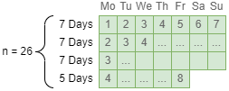
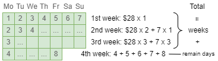
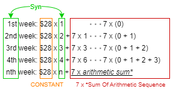
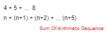

# 1716. 计算力扣银行的钱

# 问题

Hercy 想要为购买第一辆车存钱。他 **每天** 都往力扣银行里存钱。

最开始，他在周一的时候存入 `1` 块钱。从周二到周日，他每天都比前一天多存入 `1` 块钱。在接下来每一个周一，他都会比 **前一个周一** 多存入 `1` 块钱。

给你 `n` ，请你返回在第 `n` 天结束的时候他在力扣银行总共存了多少块钱。

 

**示例 1：**

```
输入：n = 4
输出：10
解释：第 4 天后，总额为 1 + 2 + 3 + 4 = 10 。
```

**示例 2：**

```
输入：n = 10
输出：37
解释：第 10 天后，总额为 (1 + 2 + 3 + 4 + 5 + 6 + 7) + (2 + 3 + 4) = 37 。注意到第二个星期一，Hercy 存入 2 块钱。
```

**示例 3：**

```
输入：n = 20
输出：96
解释：第 20 天后，总额为 (1 + 2 + 3 + 4 + 5 + 6 + 7) + (2 + 3 + 4 + 5 + 6 + 7 + 8) + (3 + 4 + 5 + 6 + 7 + 8) = 96 。
```

> 问题链接: [LeetCode - 1716. 计算力扣银行的钱 (简单)](https://leetcode.cn/problems/calculate-money-in-leetcode-bank/)
>
> 相关标签：贪心 数组 等差数列

# 思路

### 第一步

如果n=26天，也就是从星期一开始，26天之后银行存了多少钱。26 天可分为3周+5天：



### 第二步

无论总天数是是多少，完整的地x周的收益都是一样的。如：n=8，有完整的第一周，第一周总数为28；n=26，也有完整的第一周，第一周总数也为28。

💡 `完整周的累计总和`和`最后剩下天数的和` = 总和

所以n=26时，`完整周的累计总和`和`最后剩下天数的和`分别为：



### 第三步

完整周的累计总和

```java
1st week = 1 + 2 + 3 + 4 + 5 + 6 + 7 
     	 = 28
    
2nd week = (week1) + 2 + 3 + 4 + 5 + 6 + 7 + 8 
    	 =(1 + 2 + 3 + 4 + 5 + 6 + 7) + 2 + 3 + 4 + 5 + 6 + 7 + 8 
    	 =(1 + 2 + 3 + 4 + 5 + 6 + 7) +[(1 + 2 + 3 + 4 + 5 + 6 + 7) + 7]
    	 = (1 + 2 + 3 + 4 + 5 + 6 + 7) x 2 + 7 
    	 = 28 x 2 + 7
    
3rd week = 28 x 3 + 7 + 7  +  7
              week2 ^   ^week3^
    	 = 28 x 3 + 7 x 3
    
4th week = 28 x 4 + 7 x 6
    ...
nth week = 28 x n + 7 x (等差数列求和)
		 = 28 x n + 7 x (n * [2 * a + (m − 1) * d] / 2)
```

等差数列求和：

m * [2 * a + (m − 1) * d] / 2

可以看出`28 x m + 7 x (n * [2 * a + (m − 1) * d] / 2)`是`完整周的累计总和`的通用公式。

* m = 完整周的个数 = 26 / 7 = 3
* a = 起始钱数 = 1
* d = 差值 = 1 (总是比上周一多1块钱)

图表表示：



### 第四步

最后剩下天数的和：4 + 5 + 6 + 7 + 8 经典的等差数列求和。

m * [2 * a + (m − 1) * d] / 2

* m = 剩下的天数 = 26 \% 7 = 5
* a = 起始钱数 = 1 + 第x周 = 1 + 4
* d = 差值 = 1 (总是比昨天多1块钱)

图表表示：



💡 `完整周的累计总和`和`最后剩下天数的和` = 总和

# 关键

通过计算每周的收益加上最后的几天，可以直接算出“周”的总数和剩下的“日”的总数。时间和空间复杂度都为O(1)。

而用for遍历26天的时间和空间复杂度分别为O(n)和O(1)。


**等差数列求和公式**：

Sn=n[2a+(n−1)d]/2

- Sn = 总和
- n = 项目个数 / 数列长度
- a = 首个项目 / 起始数字
- d = 差值

# 代码

```java
public int totalMoney(int n) {
    	// 完整周的个数
        int wholeWeeks = n / 7;
		
    	// 算出除了第一周的完整周，当连一个完整周都没有时不-1。-1是为了计算方便，第一周不算在等差数列里。
        int followingWeeks = wholeWeeks > 0 ? wholeWeeks - 1 : 0;
    	// 套用公式 28 x m + 7 x (等差数列求和)
        int extra7 = followingWeeks * (2 + (followingWeeks - 1)) / 2;
        int money = (28 * wholeWeeks) + extra7 * 7;
		
    	// 剩下的天数
        int remainDay = n % 7;
    	// 套用公式 等差数列求和
        money += remainDay * (2*(1 + wholeWeeks) + (remainDay - 1))/2;

        return money;
    }
```