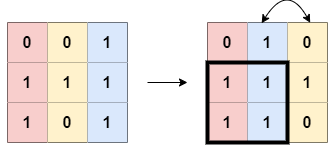
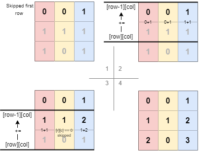
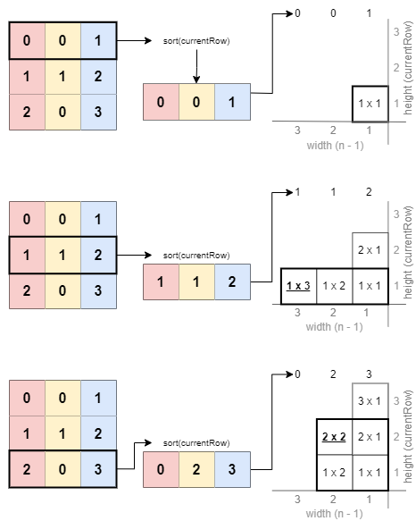

# 1727. 重新排列后的最大子矩阵

问题链接: [LeetCode - 1727. 重新排列后的最大子矩阵 (中等)](https://leetcode.cn/problems/largest-submatrix-with-rearrangements/)

相关标签：贪心 2维数组

# Think



题目说要通过调换二维数组的列找到可能最大的子数组的面积，但由于只要返回一个int的数字，所以关键是最大的子数组的`面积`，而不是面积最大调换的`步骤`。

首先，对于每一列，我们计算从该列向上的连续1的数量，将其存储在matrix数组中。 

然后，对于每一行，我们对该行的列进行排序，然后计算以每一列为右边界的最大矩形面积。

# Key


💡 把二维数据的数据根据规律，抽象成一维数组

- 通过`arr[i] += arr[i-1]`的自己+自己上一个数据的操作，计算从该列向上的连续1的数量



- 对于每一行，对该行的进行排序，通过排序把数组整理成拥有最大子数组的最佳情况
- 然后计算以每一列为右边界的最大矩形面积



# Answer

```java
public int largestSubmatrix(int[][] matrix) {
	  int m = matrix.length;
	  int n = matrix[0].length;
	  int ans = 0;
	  
	  for (int row = 0; row < m; row++) {
	      for (int col = 0; col < n; col++) {
	          if (matrix[row][col] != 0 && row > 0) { 
						// row > 0; 防止row-1造成的out of bounds。第一行没有上一行
	              matrix[row][col] += matrix[row - 1][col];
								// 用+=，如果不是0，自己的格子算一个+上 上面（累计）的的格子数量
	          }
	      }
	      
				// 由于需要排序数组，为了不影响原数组的"连续element的数据"，新建一个数组来存
				// martix[row].clone() 影子克隆原数组的某一行
	      int[] currRow = matrix[row].clone();
	      Arrays.sort(currRow);
	      for (int i = 0; i < n; i++) {
						// 如果当前ans大的话就保留ans，如果是新的子数组面积最大的话替换ans成新的
	          ans = Math.max(ans, currRow[i] * (n - i));
	      }
	  }
	  
	  return ans;
}
```